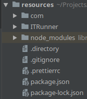
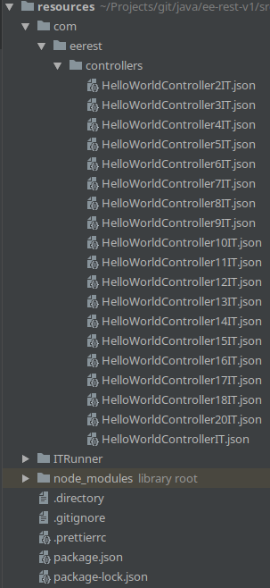

# newman-runner
The Runner of API Integration Tests. Run Postman based collections via multiple Newman instances.

Helps to speed up newman execution of multiple collections (reads collections recursively).

Supports asynchronous and [thread pool](https://nodejs.org/api/cluster.html) (cluster API) mode.

### File structure




### Requirments
* Exported postsman collections
* Node v10. Tested on `10.15.3`. Possibly some changes required for supporting earlier versions.

### How to run
* Setup `newman` config at ITRunner\newmanConfig.js
* (Optional) Check command line parameters and defaults in ITRunner\newmanConfig.js.
* Execute tests with `npm run test` or with parameters `npm run test 8080 5 true`

### Command line options
* Port: 8080 by default
* Task count (asynchronous mode) or number of workers (thread pool mode): 5 by default
* Asynchronous tasks / thread pool flag: thread pool by default

### Examples
```bash
# Default configuration (short)
$ npm run test

# Default configuration with parametrs (for thread pool no need to provide parameter)
$ npm run test 8080 5

# Asynchronous mode
$ npm run test 8080 5 true
```
### Important notes
* Use asynchronous in case of small amount of collections (< 100)
* Use thread pool in case of large amount of collections
* Default value for tasks / threads is 5. It have been defined experimentally.
A larger amount of tasks / threads not provide a good enough performance impact,
but consumes a lot more resources. So try to find optimal value for your case.
* **Don't use cli reporter in thread pool mode.**
Output from multiple sources slowdown the overall process and mix tests results output (hard to read in the end).
Asynchronous mode is slower, but basically have the same problems. That's why it's no recommended also.